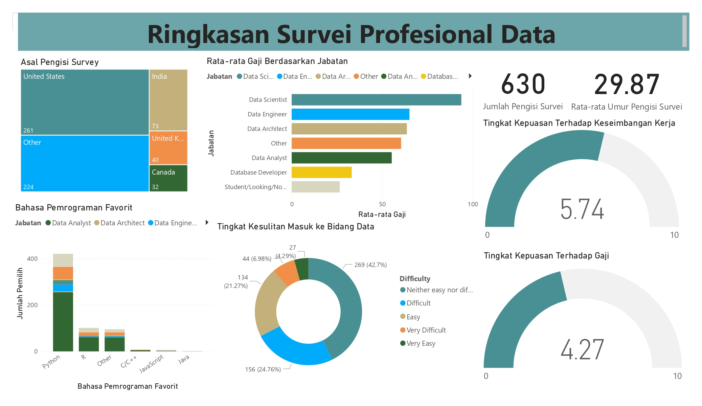

# Project Power BI: Analisis Hasil Survei Profesional

Dashboard interaktif yang dibuat menggunakan **Power BI**, untuk menganalisis hasil survei dari para profesional dan mahasiswa di berbagai bidang teknologi dan data.

Dashboard ini menyajikan berbagai insight seperti:

- Rata-rata gaji berdasarkan jabatan
- Bahasa pemrograman favorit
- Tingkat kesulitan masuk ke bidang data
- Tingkat kepuasan terhadap keseimbangan kerja (work-life balance) dan gaji
- Demografi pengisi survei (jumlah, rata-rata umur)

## Fitur Dashboard

- Ringkasan jumlah pengisi survei dan rata-rata umur
- Visualisasi interaktif berbagai metrik penting
- Kombinasi chart: bar, donut, KPI gauge
- Layout bersih dan mudah dieksplorasi

## Tools yang Digunakan

- Power BI Desktop
- Dataset hasil survei profesional (Power BI Final Project.xlsx)

## Preview Dashboard

## Cara Membuka

1. Clone atau download repository ini
2. Buka file `.pbix` menggunakan **Power BI Desktop**
   
## Sumber Data

Dataset diambil dari repository GitHub [Alex The Analyst - Power BI Final Project](https://github.com/AlexTheAnalyst/Power-BI/blob/main/Power%20BI%20-%20Final%20Project.xlsx).

**Catatan:**  
Responden survei terdiri dari berbagai latar belakang, termasuk profesional aktif di bidang teknologi dan data, serta mahasiswa yang sedang menempuh pendidikan di bidang terkait.
